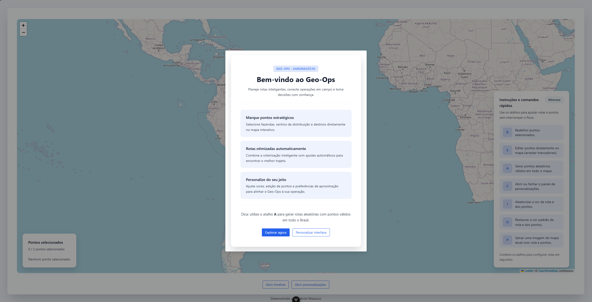
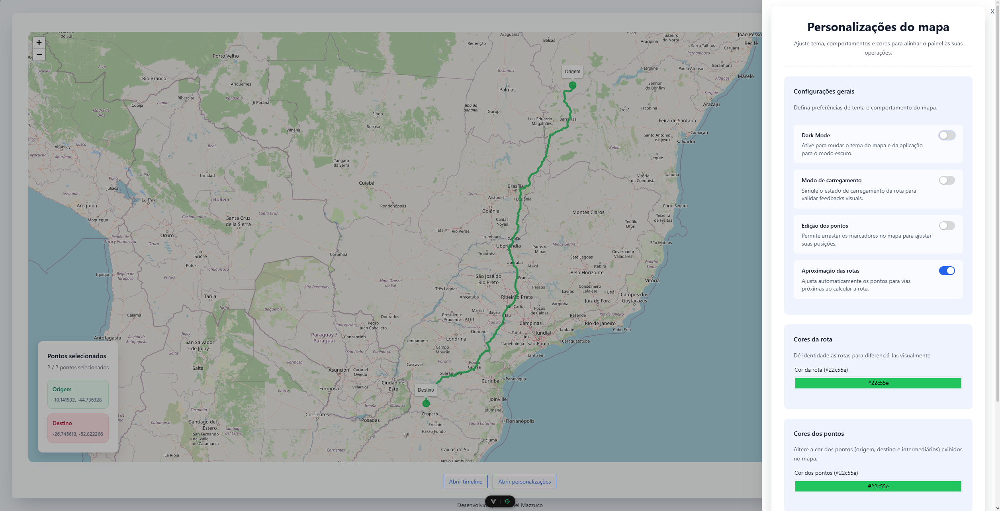
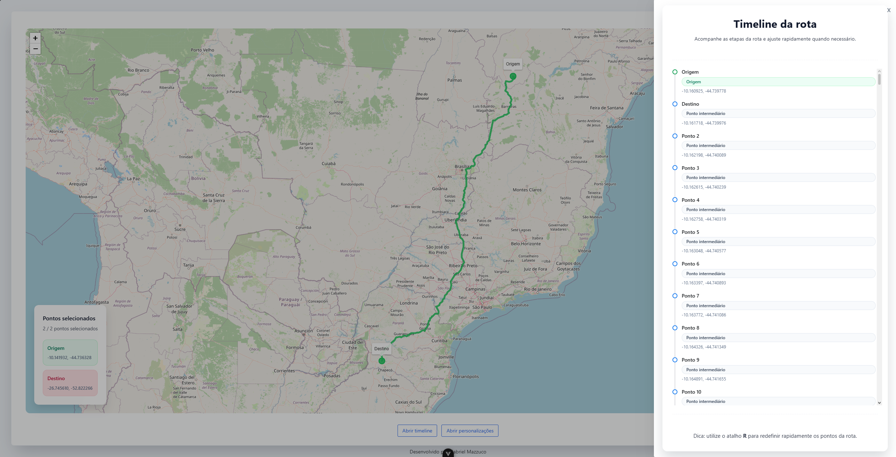
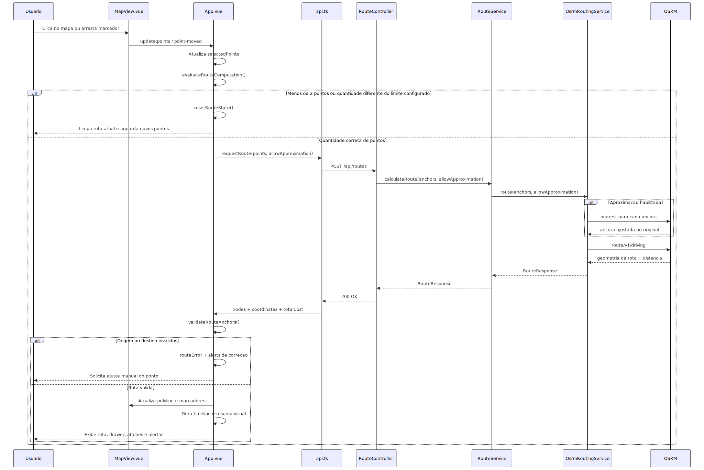

<h1 align="center">Geo-Ops</h1>

<p align="center">
  Planejamento de rotas para operações em campo, com mapa interativo, cálculo automático de trajetos e painel de personalização visual.
</p>

<p align="center">
  
  
  
  
</p>

<p align="center">
  
  
  
  
</p>

<p align="center">
  
</p>

O **Geo-Ops** é uma aplicação web voltada ao planejamento de rotas operacionais com foco em visualização geográfica. O sistema permite selecionar pontos diretamente no mapa, calcular trajetos automaticamente, validar âncoras fora de área útil, aproximar marcadores para vias próximas e acompanhar a rota em tempo real por meio de timeline, alertas e painéis de apoio.

O projeto foi estruturado com **frontend em Vue 3 + Vite** e **backend em Spring Boot**, utilizando **Leaflet** para a experiência cartográfica e **OSRM** para a roteirização. A proposta visual foi pensada para um contexto operacional do agronegócio, com suporte a tema claro/escuro, customização de cores, edição de pontos e geração de imagem do mapa.

<h2 align="center" id="visao-geral">Visão geral</h2>

O Geo-Ops foi desenhado para um fluxo simples:

1. O usuário seleciona pontos diretamente no mapa.
2. O frontend identifica quando a quantidade configurada de pontos foi atingida.
3. O backend recebe a requisição e tenta calcular a rota.
4. Quando habilitada, a aproximação de pontos usa o endpoint `nearest` do OSRM para aproximar âncoras de vias válidas.
5. O resultado volta para o frontend em formato de coordenadas geográficas.
6. A rota é desenhada no mapa, com alertas, timeline e estado visual sincronizado.

O sistema atualmente não possui autenticação nem persistência em banco de dados. O foco do repositório está na experiência de roteirização, interação no mapa e camada de integração entre frontend e backend.

<h2 align="center" id="funcionalidades">Funcionalidades</h2>

<p align="center">
  
</p>

<p align="center">
  
</p>

- Selecionar origem, destino e pontos intermediários diretamente no mapa.
- Calcular rotas automaticamente quando a quantidade máxima de pontos configurada é atingida.
- Configurar entre **2 e 6 pontos** pela interface.
- Exibir marcadores com papéis visuais distintos para origem, destino e waypoints.
- Permitir edição de pontos por arraste no mapa.
- Validar pontos fora de área acessível por terra.
- Aproximar automaticamente pontos para vias próximas antes do cálculo da rota.
- Gerar rotas aleatórias válidas em regiões do Brasil.
- Alterar cor da rota e dos marcadores.
- Alternar entre tema claro e escuro com persistência em `localStorage`.
- Exibir timeline da rota em drawer lateral.
- Exibir alertas contextuais de sucesso, erro, aviso e informação.
- Exportar uma imagem PNG do mapa atual.
- Abrir modal de boas-vindas e modal institucional do projeto.

<h2 align="center" id="fluxo-principal-de-uso">Fluxo principal de uso</h2>

1. Ao abrir a aplicação, o usuário encontra o modal introdutório com o contexto do sistema.
2. No mapa principal, cada clique adiciona um novo ponto.
3. Quando a quantidade limite de pontos é atingida, a rota é calculada automaticamente.
4. Se o usuário ultrapassar o limite com um novo clique, a seleção recomeça a partir desse ponto como nova origem.
5. O painel inferior esquerdo mostra os pontos escolhidos.
6. O painel inferior direito mostra os atalhos disponíveis.
7. O drawer de timeline apresenta o encadeamento da rota.
8. O drawer de personalização permite ajustar tema, cores, limite de pontos e comportamento de aproximação.

<h2 align="center" id="arquitetura-do-sistema">Arquitetura do sistema</h2>

Esta seção foi pensada para explicar o Geo-Ops de forma didática: primeiro a visão geral da arquitetura, depois a sequência real de execução da rota e por fim a lógica de decisão do frontend.

<h3 align="center" id="visao-macro-da-arquitetura">Visão macro da arquitetura</h3>

O fluxo macro foi separado em três quadros para ficar mais legível: entrada dos dados, processamento da rota e retorno visual para a interface.

<h4 align="center" id="etapa-1-entrada-e-preparacao-no-frontend">Etapa 1. Entrada e preparação no frontend</h4>
<p align="center">
  
</p>

<h4 align="center" id="etapa-2-processamento-e-roteirizacao-no-backend">Etapa 2. Processamento e roteirização no backend</h4>
<p align="center">
  
</p>

<h4 align="center" id="etapa-3-retorno-validacao-e-atualizacao-da-interface">Etapa 3. Retorno, validação e atualização da interface</h4>
<p align="center">
  
</p>

<h3 align="center" id="fluxo-real-de-execucao-de-uma-rota">Fluxo real de execução de uma rota</h3>

<p align="center">
  
</p>

<h3 align="center" id="regra-de-decisao-do-frontend">Regra de decisão do frontend</h3>

Este é o ponto principal para entender o comportamento automático do sistema: a rota não é calculada a cada clique isolado. O `App.vue` observa os pontos selecionados, o limite máximo configurado e a flag de aproximação. A partir disso, decide se deve limpar, recalcular ou apenas aguardar.

<p align="center">
  
</p>

<h3 align="center" id="responsabilidade-de-cada-parte">Responsabilidade de cada parte</h3>

| Parte | Responsabilidade prática | Por que ela existe |
| --- | --- | --- |
| `frontend/src/components/MapView.vue` | Renderiza mapa, marcadores, tooltips e polyline; emite eventos de clique e arraste | Isolar a camada cartográfica da lógica de negócio |
| `frontend/src/App.vue` | Controla estado global da tela, atalhos, alertas, drawers, modais, validações e requisições | Concentrar a orquestração da interface em um único ponto |
| `frontend/src/services/api.ts` | Envia `POST /api/routes` com os pontos selecionados | Separar a integração HTTP do restante da UI |
| `frontend/src/stores/theme.ts` | Persiste e alterna tema claro/escuro | Evitar espalhar lógica de tema pelos componentes |
| `backend/src/main/java/com/geo/api/routing/RouteController.java` | Expor a API REST | Ser a porta de entrada do backend |
| `backend/src/main/java/com/geo/api/routing/RouteService.java` | Validar entrada e coordenar o cálculo | Centralizar regra de negócio antes da integração externa |
| `backend/src/main/java/com/geo/api/routing/OsrmRoutingService.java` | Chamar `nearest` e `route` do OSRM | Encapsular toda a dependência externa de roteirização |
| `OSRM` | Calcular trajetos viários e ajustar pontos para vias válidas | Fornecer o motor de roteirização real |
| `OpenStreetMap / CARTO` | Entregar os tiles do mapa | Dar base visual para a operação no modo claro e escuro |

<h3 align="center" id="leitura-didatica-do-funcionamento-ponta-a-ponta">Leitura didática do funcionamento ponta a ponta</h3>

1. O usuário monta uma rota clicando no mapa.
2. O mapa não decide nada sozinho; ele apenas emite eventos com as coordenadas.
3. O `App.vue` recebe esses eventos, atualiza `selectedPoints` e observa se a quantidade de pontos atingiu exatamente o limite configurado.
4. Quando esse limite é atingido, o frontend chama o backend com os pontos atuais.
5. O backend não calcula rota diretamente; ele delega para o OSRM, que é o serviço especializado em roteirização.
6. Se a opção de aproximação estiver ligada, o backend tenta primeiro ajustar cada âncora para uma via real próxima.
7. Depois disso, o backend pede ao OSRM a geometria completa da rota.
8. O retorno da API volta para o frontend com três informações principais:
   - `nodes`: nomes lógicos como Origem, Destino e pontos intermediários.
   - `coordinates`: lista de coordenadas que será desenhada como linha no mapa.
   - `totalCost`: distância total da rota em quilômetros.
9. O frontend ainda faz uma segunda validação: compara os pontos escolhidos com o início e o fim da rota retornada. Isso existe para identificar casos em que o usuário marcou oceano, área sem acesso ou um ponto muito distante da malha viária.
10. Se tudo estiver válido, a rota aparece no mapa e a interface secundária é atualizada: timeline, drawers, alertas e resumo visual.
11. Se algo falhar, o sistema não apenas mostra erro bruto. Ele tenta diagnosticar o ponto problemático e orientar o ajuste manual.

<h2 align="center" id="api-backend">API backend</h2>

Atualmente, o endpoint funcional exposto no backend é:

<h3 align="center" id="post-api-routes"><code>POST /api/routes</code></h3>

Calcula a rota com base nos pontos enviados.

<h4 align="center" id="exemplo-de-requisicao">Exemplo de requisição</h4>

```json
{
  "points": [
    [-23.55052, -46.633308],
    [-22.906847, -43.172897]
  ],
  "allowApproximation": true
}
```

<h4 align="center" id="exemplo-de-resposta">Exemplo de resposta</h4>

```json
{
  "nodes": ["Origem", "Destino"],
  "coordinates": [
    { "lat": -23.55052, "lon": -46.633308 },
    { "lat": -23.548201, "lon": -46.630417 }
  ],
  "totalCost": 434.27
}
```


<h2 align="center" id="tecnologias-utilizadas">Tecnologias utilizadas</h2>

| Camada | Badge | Tecnologia | Papel no projeto |
| --- | --- | --- | --- |
| Frontend |  | Vue 3 | Estrutura principal da interface |
| Build |  | Vite | Desenvolvimento local e build de produção |
| UI |  | Naive UI | Drawers, alerts, timeline, modais |
| Mapa |  | Leaflet | Renderização do mapa e marcadores |
| Estado |  | Pinia | Persistência e controle de tema |
| Estilo |  | Tailwind CSS 4 | Utilitários e apoio visual |
| Exportação |  | html-to-image | Geração de snapshot PNG do mapa |
| Backend |  | Spring Boot | API de roteirização |
| Linguagem backend |  | Java 21 | Implementação da camada de serviço |
| Roteirização |  | OSRM | Cálculo de trajeto e snap para via |
| Base cartográfica |   | OpenStreetMap / CARTO | Tiles do mapa |

<h2 align="center" id="estrutura-do-projeto">Estrutura do projeto</h2>

```text
Geo-Ops/
|-- backend/
|   |-- pom.xml
|   `-- src/main/
|       |-- java/com/geo/api/
|       |   |-- ApiApplication.java
|       |   `-- routing/
|       |       |-- RouteController.java
|       |       |-- RouteService.java
|       |       |-- OsrmRoutingService.java
|       |       |-- RouteRequest.java
|       |       |-- RouteResponse.java
|       |       `-- Coordinate.java
|       `-- resources/
|           `-- application.properties
|-- frontend/
|   |-- package.json
|   |-- src/
|   |   |-- App.vue
|   |   |-- App.css
|   |   |-- components/
|   |   |-- services/
|   |   |-- stores/
|   |   `-- global/styles/
|   `-- e2e/
|-- docs/
|   |-- diagrams/
|   `-- images/
|-- geo_ops.sh
`-- README.md
```

<h3 align="center" id="arquivos-centrais">Arquivos centrais</h3>

- `frontend/src/App.vue`: coordenação principal da página, estados, atalhos, drawers e modais.
- `frontend/src/components/MapView.vue`: mapa Leaflet, marcadores, arraste de pontos e desenho da rota.
- `frontend/src/services/api.ts`: cliente HTTP do frontend.
- `backend/src/main/java/com/geo/api/routing/RouteController.java`: endpoint REST de roteirização.
- `backend/src/main/java/com/geo/api/routing/RouteService.java`: regras de validação e orquestração do cálculo.
- `backend/src/main/java/com/geo/api/routing/OsrmRoutingService.java`: integração com OSRM.
- `geo_ops.sh`: script de inicialização automatizada da stack.

<h2 align="center" id="instalacao">Instalação</h2>

<h3 align="center" id="pre-requisitos">Pré-requisitos</h3>

- **Java 21** ou superior.
- **Node.js 20.19.0+** ou **22.12.0+**.
- **npm** instalado.
- Conexão com a internet para consumir OSRM e tiles do mapa.

<h3 align="center" id="clonando-o-projeto">Clonando o projeto</h3>

```bash
git clone <url-do-repositorio> Geo-Ops
cd Geo-Ops
```
<h2 align="center" id="execucao-do-projeto">Execução do projeto</h2>

<h3 align="center" id="opcao-1-script-automatizado">Opção 1: script automatizado</h3>

O projeto possui um orquestrador chamado `geo_ops.sh`, que:

- valida Java, Node.js e npm;
- instala dependências do frontend;
- compila o backend;
- sobe backend e frontend;
- registra logs em `./logs`;
- encerra os serviços com segurança ao receber `Ctrl+C`.

```bash
./geo_ops.sh
```

Ao final, a stack fica disponível em:

- Frontend: `http://localhost:5173`
- Backend: `http://localhost:8090`

<h3 align="center" id="opcao-2-execucao-manual">Opção 2: execução manual</h3>

<h4 align="center" id="execucao-backend">Backend</h4>

```bash
cd backend
./mvnw spring-boot:run
```

<h4 align="center" id="execucao-frontend">Frontend</h4>

```bash
cd frontend
npm install
npm run dev
```

Com isso:

- Frontend: `http://localhost:5173`
- Backend: `http://localhost:8090`

<h2 align="center" id="aliare">Aliare</h2>

<p align="center">
  
</p>
<p align="center">
  A <strong>Aliare</strong> é uma empresa brasileira de tecnologia voltada ao agronegócio, reconhecida pelo desenvolvimento de soluções de gestão e operação para diferentes elos da cadeia agro. Neste projeto, ela aparece como referência de contexto por representar um ambiente real em que eficiência logística, roteirização e suporte à tomada de decisão em campo são necessidades centrais.
</p>

<h2 align="center" id="autor">Autor</h2>

<p align="center">
  
</p>
<p align="center">
  <strong>Gabriel Mazzuco</strong><br />
  Cientista da computação, formado na Universidade Estadual do Oeste do Paraná (Unioeste) em 2025, atuando na área de desenvolvimento de software desde então. Sempre buscando novas tecnologias e soluções para criar novos projetos.
</p>
<p align="center">
  <a href="https://github.com/gabrielmazz">GitHub</a>
  &nbsp;|&nbsp;
  <a href="https://www.linkedin.com/in/gabriel-alves-mazzuco">LinkedIn</a>
  &nbsp;|&nbsp;
  <a href="mailto:gabrielalvesmazzuco@gmail.com">E-mail</a>
</p>
